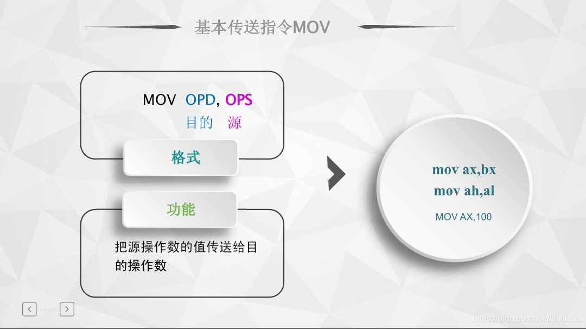

#### mov:

#### offset

MOV BX,OFFSET TABLE
解释：意思是将TABLE的首地址传送给基址寄存器BX，OFFSET +X符识符，表示取X的首地址。

#### .quad 

.quad 定义八个字节的数据，类似的还有.byte .short .long .float .string .asciz .sacii .rept .quad

#### .string

.string 和 .asciz 和 .sacii 一样都是定义多个字符串，.ascii 要加‘\0'

.**equ .set**

.equ/.set 赋值语句

#### .entry

.entry ；声明程序入口

#### .size

.size :设定指定符号的大小。“.size main,.-main”中的”.”表示当前地址，减去main符号的地址为整个main函数的大小。

#### .ascii

.ascii "Hello ARM!\000" @声明字符串
